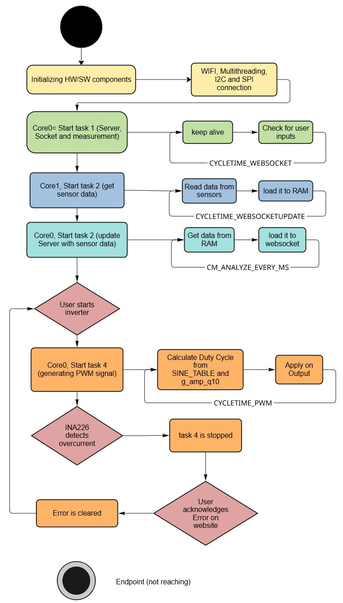

# H-Bridge PCB Project

## Project Description
This project involves the design and implementation of an H-Bridge using an Espressif ESP32 controller. The H-Bridge can control loads with the following specifications:

- **Input Voltage:** 24V  
- **Input Current:** 10A  
- **Power:** 240W  

The project consists of two main components:  
1. **H_Bridge_PCB_Design:** Contains the complete PCB design in KiCad.  
2. **H_Bridge_PCB_Code:** Contains the code for the ESP32 to control the H-Bridge.  

---

## Directory Structure

```
H_Bridge_PCB_Project/
│-- H_Bridge_PCB_Design/   # PCB design (KiCad files)
│-- H_Bridge_PCB_Code/     # Source code for the ESP32
│-- images/                # images used in the README.md
│-- README.md              # This file
```

---

## Requirements
Before starting the project, the following software and hardware components should be available:

### Hardware:
- PCB according to the KiCad design  

### Software:
- [KiCad](https://www.kicad.org/) (for PCB design)  
- [PlatformIO](https://platformio.org/) (for ESP32 development)  
- [VS Code](https://code.visualstudio.com/) (recommended for code development)

## Code
The project is mostly written in C++. For the Website jss, html and css was used.
### Structure
```

H_Bridge_PCB_Code/           
│-- data/                    # Server data directory
│   │-- index.html           # html file for webserver
│   │-- script.js            # js file for webserver
│   │-- style.css            # css file for webserver
│-- src/                 # Main code directory
│   │-- I2C.cpp              #file for output and input measurement that both can work with the same I2C bus
│   │-- Input_meas.cpp       #Input measurement of voltage, current and power 
│   │-- main_OutputTest.cpp  #Testfile for calibration of Output sensor (should be outcommented in normal use)
│   │-- main.cpp             #implementation of the Multithreading
│   │-- mutexdefinitions.cpp #mutex definitions prevent concurrent memory access in measurement and inverter tasks
│   │-- Output_meas.cpp      #Output measurement of VRMS, IRMS, active and reactive Power, Frequency and Phase
│   │-- PWM.cpp              #class with all inverter functions
│   │-- webserver.cpp        #webserver cpp file
│-- include/           # Header files directory
│-- lib/               # Additional libraries
│-- platformio.ini     # Configuration file for PlatformIO
```
### Flowchart


### Code Documentation

The `HBridgeInverter` class handles the control of an H-Bridge inverter using the ESP32. Below is a breakdown of its main functionalities:

- **startInverter()**: Initializes the inverter if it is not already running.
- **stopInverter()**: Stops the inverter and resets all PWM outputs.
- **HBridgeInverter() constructor**: Initializes the PI controller and precomputes a sine wave table.
- **begin()**: Configures PWM channels and GPIOs.
- **computePI()**: Implements a PI control algorithm. (Not done yet)
- **getmeasurements()**: Retrieves input and output measurements.
- **generateSPWM()**: Generates the sinusoidal PWM signal for bipolar and unipolar modulation.
- **loop()**: Runs the main control loop, adjusting the PWM duty cycle based on the reference voltage.

